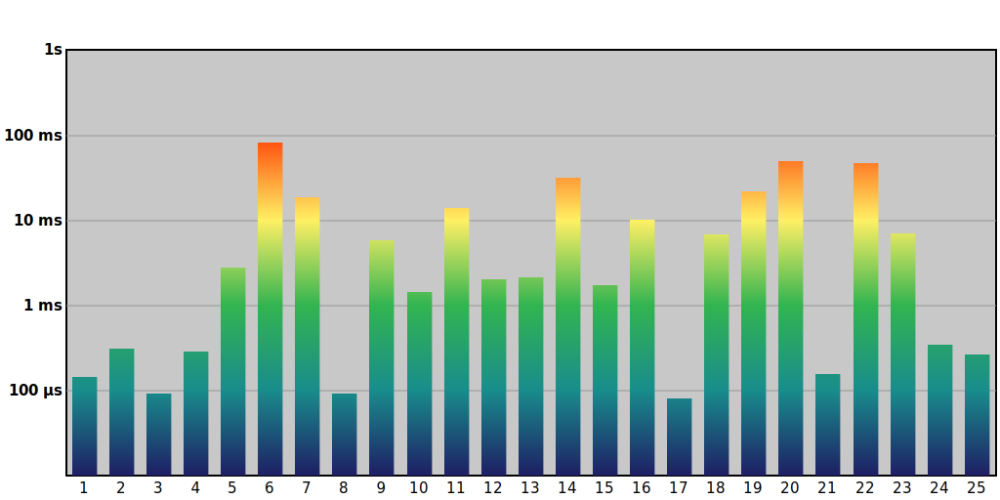
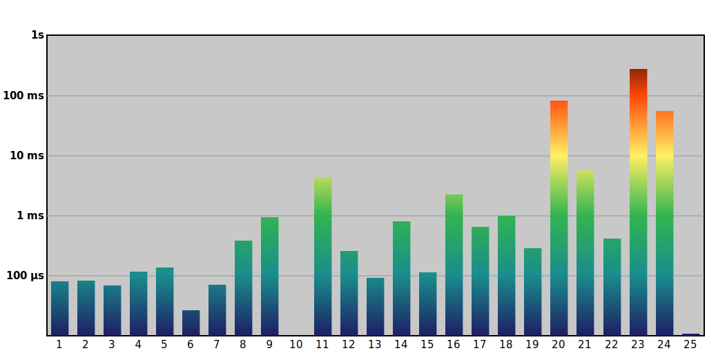

# My solutions for the Advent of Code 2024 puzzles, in Rust

## Usage

1. The application expects your input files to be in the [./input/2024](./input/2024) directory. Each file must be named according to the day number: `01.txt`, .. `25.txt`.
2. There is only one binary to compile, that invokes all the daily puzzles in sequence (see [./src/main.rs](./src/main.rs) )

## Performance

I focus on code *readability* and *usability* first, instead of seeking for performance at all cost. As such, this code is well documented and should be very understandable.
Here are the results I get to solve the two parts of the problems:

> All benchmarks are run on an **AMD Ryzen 9 5900X**, *single thread*

### [2024](https://adventofcode.com/2024)

| Day | Puzzle                                                         | Code                               | Perf. (ms) |
|-----|----------------------------------------------------------------|------------------------------------|------------|
| 01  | [Historian Hysteria](https://adventofcode.com/2024/day/1)      | [day_01.rs](./src/y2024/day_01.rs) | 0.144      |
| 02  | [Red-Nosed Reports](https://adventofcode.com/2024/day/2)       | [day_02.rs](./src/y2024/day_02.rs) | 0.311      |
| 03  | [Mull It Over](https://adventofcode.com/2024/day/3)            | [day_03.rs](./src/y2024/day_03.rs) | 0.094      |
| 04  | [Ceres Search Hysteria](https://adventofcode.com/2024/day/4)   | [day_04.rs](./src/y2024/day_04.rs) | 0.287      |
| 05  | [Print Queue](https://adventofcode.com/2024/day/5)             | [day_05.rs](./src/y2024/day_05.rs) | 2.842      |
| 06  | [Guard Gallivant](https://adventofcode.com/2024/day/6)         | [day_06.rs](./src/y2024/day_06.rs) | 82.53      |
| 07  | [Bridge Repair](https://adventofcode.com/2024/day/7)           | [day_07.rs](./src/y2024/day_07.rs) | 18.76      |
| 08  | [Resonant Collinearity](https://adventofcode.com/2024/day/8)   | [day_08.rs](./src/y2024/day_08.rs) | 0.093      |
| 09  | [Disk Fragmenter](https://adventofcode.com/2024/day/9)         | [day_09.rs](./src/y2024/day_09.rs) | 5.824      |
| 10  | [Hoof It](https://adventofcode.com/2024/day/10)                | [day_10.rs](./src/y2024/day_10.rs) | 1.446      |
| 11  | [Plutonian Pebbles](https://adventofcode.com/2024/day/11)      | [day_11.rs](./src/y2024/day_11.rs) | 14.03      |
| 12  | [Garden Groups](https://adventofcode.com/2024/day/12)          | [day_12.rs](./src/y2024/day_12.rs) | 2.043      |
| 13  | [Claw Contraption](https://adventofcode.com/2024/day/13)       | [day_13.rs](./src/y2024/day_13.rs) | 2.134      |
| 14  | [Restroom Redoubt](https://adventofcode.com/2024/day/14)       | [day_14.rs](./src/y2024/day_14.rs) | 32.20      |
| 15  | [Warehouse Woes](https://adventofcode.com/2024/day/15)         | [day_15.rs](./src/y2024/day_15.rs) | 1.727      |
| 16  | [Reindeer Maze](https://adventofcode.com/2024/day/16)          | [day_16.rs](./src/y2024/day_16.rs) | 10.14      |
| 17  | [Chronospatial Computer](https://adventofcode.com/2024/day/17) | [day_17.rs](./src/y2024/day_17.rs) | 0.082      |
| 18  | [RAM Run](https://adventofcode.com/2024/day/18)                | [day_18.rs](./src/y2024/day_18.rs) | 6.966      |
| 19  | [Linen Layout](https://adventofcode.com/2024/day/19)           | [day_19.rs](./src/y2024/day_19.rs) | 21.86      |
| 20  | [Race Condition](https://adventofcode.com/2024/day/20)         | [day_20.rs](./src/y2024/day_20.rs) | 54.94      |
| 21  | [Keypad Conundrum](https://adventofcode.com/2024/day/21)       | [day_21.rs](./src/y2024/day_21.rs) | 0.158      |
| 22  | [Monkey Market](https://adventofcode.com/2024/day/22)          | [day_22.rs](./src/y2024/day_22.rs) | 47.69      |
| 23  | [LAN Party](https://adventofcode.com/2024/day/23)              | [day_23.rs](./src/y2024/day_23.rs) | 7.036      |
| 24  | [Crossed Wires](https://adventofcode.com/2024/day/24)          | [day_24.rs](./src/y2024/day_24.rs) | 0.351      |
| 25  | [Code Chronicle](https://adventofcode.com/2024/day/25)         | [day_25.rs](./src/y2024/day_25.rs) | 0.266      |

### [2022](https://adventofcode.com/2022)

Show results

| Day | Puzzle                                                           | Code                               | Perf. (ms) |
|-----|------------------------------------------------------------------|------------------------------------|------------|
| 01  | [Calorie Counting](https://adventofcode.com/2022/day/1)          | [day_01.rs](./src/y2022/day_01.rs) | 0.084      |
| 02  | [Rock Paper Scissors](https://adventofcode.com/2022/day/2)       | [day_02.rs](./src/y2022/day_02.rs) | 0.082      |
| 03  | [Rucksack Reorganization](https://adventofcode.com/2022/day/3)   | [day_03.rs](./src/y2022/day_03.rs) | 0.072      |
| 04  | [Camp Cleanup](https://adventofcode.com/2022/day/4)              | [day_04.rs](./src/y2022/day_04.rs) | 0.112      |
| 05  | [Supply Stacks](https://adventofcode.com/2022/day/5)             | [day_05.rs](./src/y2022/day_05.rs) | 0.156      |
| 06  | [Tuning Trouble](https://adventofcode.com/2022/day/6)            | [day_06.rs](./src/y2022/day_06.rs) | 0.006      |
| 07  | [No Space Left On Device](https://adventofcode.com/2022/day/7)   | [day_07.rs](./src/y2022/day_07.rs) | 0.069      |
| 08  | [Treetop Tree House](https://adventofcode.com/2022/day/8)        | [day_08.rs](./src/y2022/day_08.rs) | 0.369      |
| 09  | [Rope Bridge](https://adventofcode.com/2022/day/9)               | [day_09.rs](./src/y2022/day_09.rs) | 0.915      |
| 10  | [Cathode-Ray Tube](https://adventofcode.com/2022/day/10)         | [day_10.rs](./src/y2022/day_10.rs) | 0.005      |
| 11  | [Monkey in the Middle](https://adventofcode.com/2022/day/11)     | [day_11.rs](./src/y2022/day_11.rs) | 7.036      |
| 12  | [Hill Climbing Algorithm](https://adventofcode.com/2022/day/12)  | [day_12.rs](./src/y2022/day_12.rs) | 0.258      |
| 15  | [Beacon Exclusion Zone](https://adventofcode.com/2022/day/15)    | [day_15.rs](./src/y2022/day_15.rs) | 0.103      |
| 16  | [Proboscidea Volcanium](https://adventofcode.com/2022/day/16)    | [day_16.rs](./src/y2022/day_16.rs) | 2.260      |
| 17  | [Pyroclastic Flow](https://adventofcode.com/2022/day/17)         | [day_17.rs](./src/y2022/day_17.rs) | 0.612      |
| 18  | [Boiling Boulders](https://adventofcode.com/2022/day/18)         | [day_18.rs](./src/y2022/day_18.rs) | 6.944      |
| 19  | [Not Enough Minerals](https://adventofcode.com/2022/day/19)      | [day_19.rs](./src/y2022/day_19.rs) | 41.25      |
| 20  | [Grove Positioning System](https://adventofcode.com/2022/day/20) | [day_20.rs](./src/y2022/day_20.rs) | 81.82      |
| 21  | [Monkey Math](https://adventofcode.com/2022/day/21)              | [day_21.rs](./src/y2022/day_21.rs) | 6.189      |
| 22  | [Monkey Map](https://adventofcode.com/2022/day/22)               | [day_22.rs](./src/y2022/day_22.rs) | 0.437      |
| 23  | [Unstable Diffusion](https://adventofcode.com/2022/day/23)       | [day_23.rs](./src/y2022/day_23.rs) | 703.6      |
| 24  | [Blizzard Basin](https://adventofcode.com/2022/day/24)           | [day_24.rs](./src/y2022/day_24.rs) | 53.75      |
| 25  | [Full of Hot Air](https://adventofcode.com/2022/day/25)          | [day_25.rs](./src/y2022/day_25.rs) | 0.012      |

